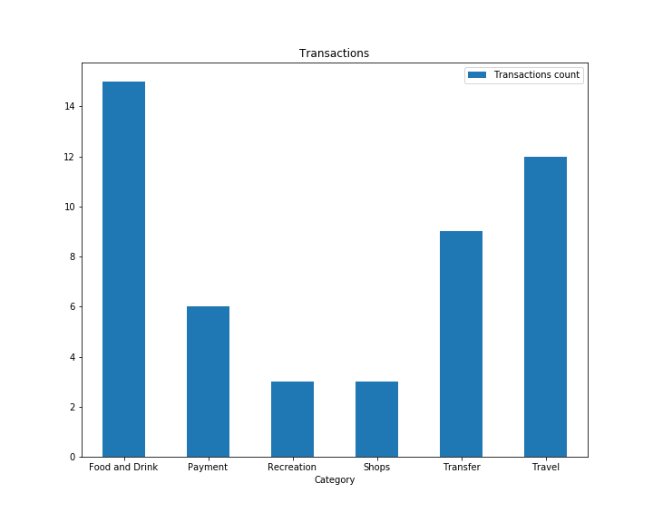
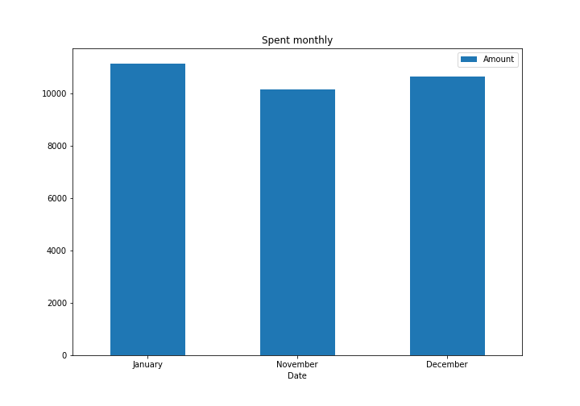
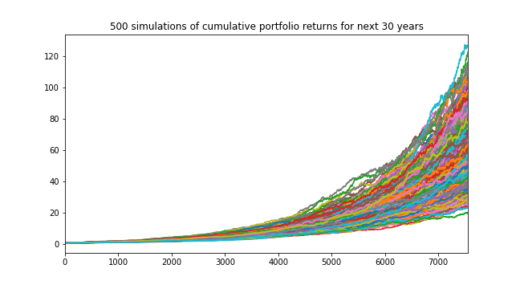
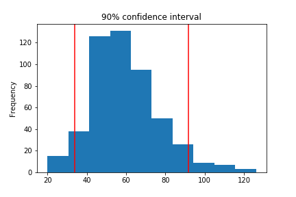

# Account Summary: Use Plaid API to obtain transaction and account data for the budget analysis.
1. Number of Transactions by Category:

2. Summary of Transactions by Months:

# Portfolio Planner: Summarize the retirement portfolio analysis and provide charts for the Monte Carlo simulation.
1. Simulation of 30 years performance of 60% SPY/ 40% AGG portfolio:

2. Histogram of 30 year performance with 90% confidence level as vertical lines:
